# recogito-studio

Recogito-Studio is ready for self-hosting and these instructions detail the steps necessary for deployment on Ubuntu Linux, v24 (although many earlier versions will also work as well). The deployment strategy utilizes [Docker](https://www.docker.com/), [Docker Compose](https://docs.docker.com/compose/), and [Nginx](https://nginx.org).

In the example below we will install Recogito Studio on a [Digital Ocean Droplet](https://docs.digitalocean.com/products/droplets/). Digital Ocean is a well-regarded cloud hosting platform known for its ease of use and competitive pricing, but the instructions are easily translated to other cloud platforms or on-premises data centers.

## System Diagram

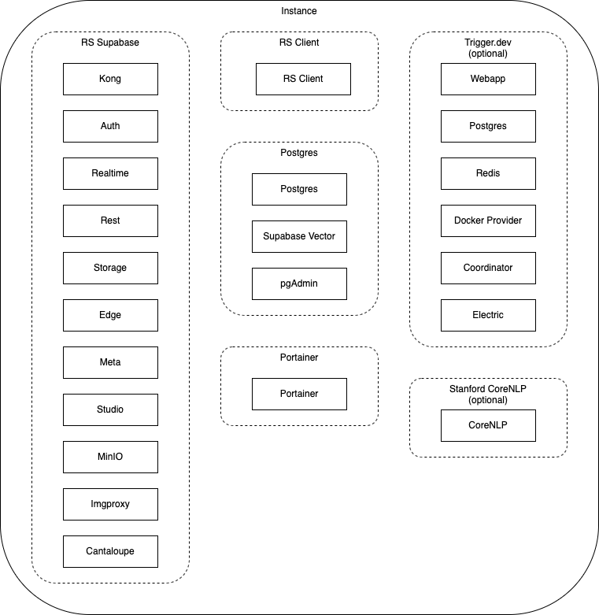

### Components

#### RS Supabase

These are most of the [Supabase](supabase.com) processes, plus the addition on [MinIO](https://min.io/) to handle object storage, and [Cantaloupe](https://cantaloupe-project.github.io/) as a IIIF server.

#### RS Client

This is the client application of Recogito Studio, written in [Astro JS](https://astro.build/). 

#### Postgres

This is a Postgres server, along with a [Supabase Vector](https://supabase.com/features/vector-database) process, and [pgAdmin](https://www.pgadmin.org/), a Postgres tools and management application.

#### Portainer

[Portainer](https://www.portainer.io/) is a container management tool which eases many aspects of managing and monitoring a docker environment.

#### Trigger.dev (optional)

[Trigger.dev](https://trigger.dev/) is a background job system. Currently only the optional [plugin-ner](https://github.com/recogito/plugin-ner) plugin uses Trigger, but future features and plugins may use it as well. Installation instructions for `plugin-ner`, including installing Trigger, are maintained in [this](https://github.com/recogito/plugin-ner) repository.

#### Stanford CoreNLP (optional)

The [Stanford CoreNLP](https://stanfordnlp.github.io/CoreNLP/) is a Natural Language Processor. Currently only the optional [plugin-ner](https://github.com/recogito/plugin-ner) plugin uses this process.

### Domains


These instructions assume that you have an available domain, with access to create new DNS records.

A full setup of a basic Recogito Studio requires five DNS records. One for the client and one for the server (although both will be served by the same instance in this example). Portainer, pgAdmin, and Min.io also need urls to access them outside of the instance. Since we are hosting Recogito Studio from the same instance, these DNS records should both point at the public IP address of the instance. For the purposes of this example we will be using:

- https://server.example.com

- https://client.example.com

- https://portainer.example.com

- https://pgadmin.example.com

- https://minio.example.com

Additionally to run the optional processes for the `plugin-ner` plugin will require access to the Trigger.dev dashboard:

- https://trigger.example.com

## Digital Ocean Example

If you do not have an account on Digital Ocean, create one and then proceed as below.

### Create new droplet (Ubuntu, latest version)

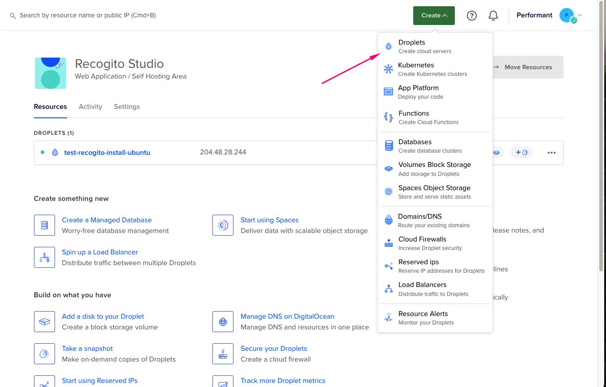

Choose an appropriate region and the recommended datacenter. For this demo we will be using the Ubuntu image and the latest version.

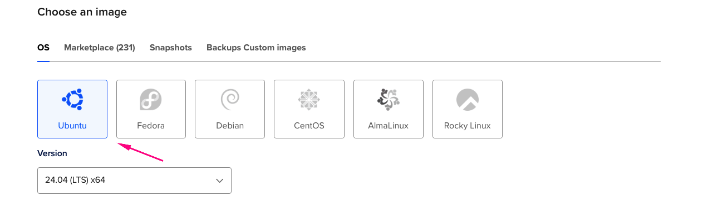

Here we choose a Basic shared CPU, Regular SSD, and a 4GB Memory, 2 CPUs, and 80GB SSD drive. In general a Recogito Studio instance should have at least 4GB memory. Recommend 50GB or more of storage.

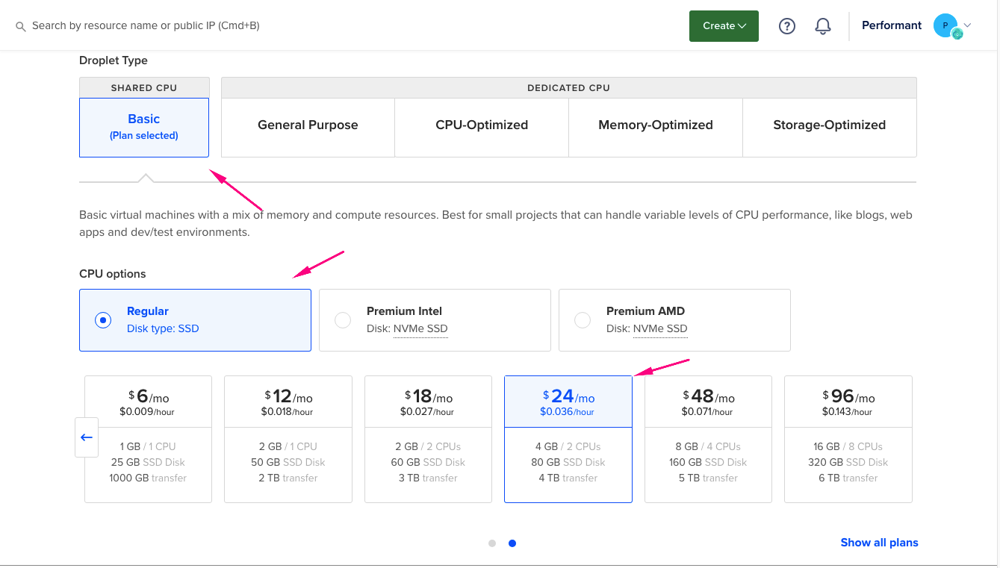

For a Production level installation, it is recommended that you enable automatic backups.

Choose your preferred Authentication Method (Here we are using Password)

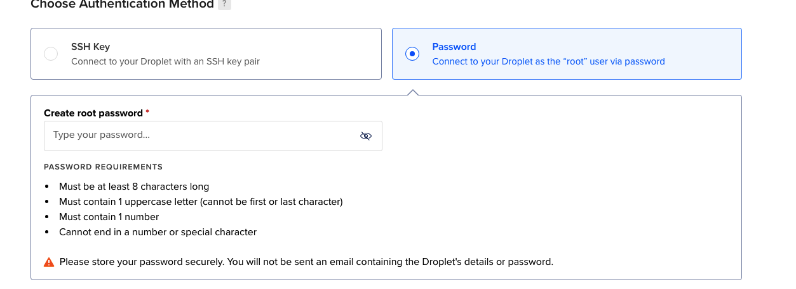

Give the instance an appropriate name and the Create Droplet.

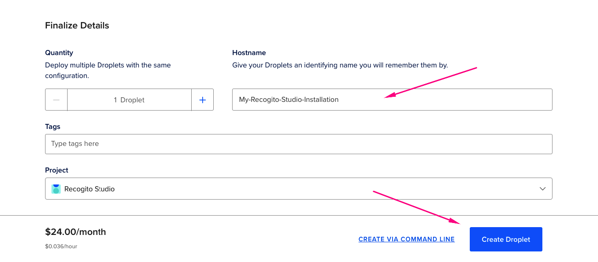

Once created navigate to your new droplet. Make note of the ipv4 address.

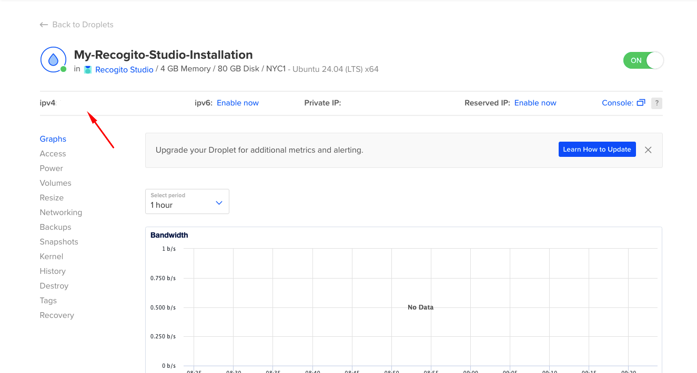

### Setup droplet with a non-root user and firewall

It is recommended that you do not use the root user for the installation. The instructions are detailed [here](https://www.digitalocean.com/community/tutorials/initial-server-setup-with-ubuntu) and summarized below.

#### SSH to your instance

```bash
ssh root@your_server_ip
```

When you first login to your instance you may see a message about available updates.

```
Expanded Security Maintenance for Applications is not enabled.

67 updates can be applied immediately.
16 of these updates are standard security updates.
To see these additional updates run: apt list --upgradable

Enable ESM Apps to receive additional future security updates.
See https://ubuntu.com/esm or run: sudo pro status


The programs included with the Ubuntu system are free software;
the exact distribution terms for each program are described in the
individual files in /usr/share/doc/*/copyright.

Ubuntu comes with ABSOLUTELY NO WARRANTY, to the extent permitted by
applicable law.
```

It is a good practice to go ahead and update your instance with the latest packages. Run apt update. apt is the general package manager for the Ubuntu OS.

```
apt update
```

#### Create a new user with sudo privileges.

```
adduser recogito
```

Specify a secure password.

```
info: Adding user `recogito' ...
info: Selecting UID/GID from range 1000 to 59999 ...
info: Adding new group `recogito' (1000) ...
info: Adding new user `recogito' (1000) with group `recogito (1000)' ...
info: Creating home directory `/home/recogito' ...
info: Copying files from `/etc/skel' ...
New password:
Retype new password:
passwd: password updated successfully
Changing the user information for recogito
Enter the new value, or press ENTER for the default
	Full Name []: Recogito User
	Room Number []:
	Work Phone []:
	Home Phone []:
	Other []:
Is the information correct? [Y/n] y
info: Adding new user `recogito' to supplemental / extra groups `users' ...
info: Adding user `recogito' to group `users' ...
```

Give user administrative privileges.

```
usermod -aG sudo recogito
```

#### Setup Firewall

Always secure your instances with firewall rules. Ubuntu servers can utilize the UFW Firewall although other methods are available. Here we will utilize UFW.

List the current firewall rules:

```
ufw app list
```

Output:

```
Available applications:
  OpenSSH
```

Allow SSH connections:

```
ufw allow OpenSSH
```

Go ahead and enable the firewall:

```
ufw enable
```

Type 'y' and press enter.

Confirm the firewall is active.

```
ufw status
```

Output:

```
Status: active

To                         Action      From
--                         ------      ----
OpenSSH                    ALLOW       Anywhere
OpenSSH (v6)               ALLOW       Anywhere (v6)
```

Follow the rest of the instructions based on how you setup authentication for your instance.

### Login with non-root user or user with sudo privledges

```
ssh recogito@your_server_ip
```

### Install Nginx

Nginx is a capable, well tested HTTP and reverse proxy server. Here we will utilize Nginx to route traffic correctly to our recogito-studio client and server.

The instructions and details on installing Nginx on Ubuntu are detailed [here](https://www.digitalocean.com/community/tutorials/how-to-install-nginx-on-ubuntu-22-04) and summarized below.

#### Install Nginx

```
sudo apt update
sudo apt install nginx
```

#### Adjust the firewall settings

Now that we have a web server, we need to update our firewall to allow HTTP and HTTPS connections to our instance.

List the available services:

```
sudo ufw app list
```

Output:

```
Available applications:
  Nginx Full
  Nginx HTTP
  Nginx HTTPS
  OpenSSH
```

As you can see we now have new options for our firewall settings with the added Nginx applications.

We are going to go ahead and allow the `Nginx Full` applications, which will allow incoming HTTP and HTTPS connections.

```
sudo ufw allow 'Nginx Full'
```

Check the status again to ensure we have successfully enabled access:

```
sudo ufw status
```

Output:

```
Status: active

To                         Action      From
--                         ------      ----
OpenSSH                    ALLOW       Anywhere
Nginx Full                 ALLOW       Anywhere
OpenSSH (v6)               ALLOW       Anywhere (v6)
Nginx Full (v6)            ALLOW       Anywhere (v6)
```

Check that Nginx is running:

```
systemctl status nginx
```

Output:

```
● nginx.service - A high performance web server and a reverse proxy server
     Loaded: loaded (/usr/lib/systemd/system/nginx.service; enabled; preset: enabled)
     Active: active (running) since Thu 2024-06-06 14:27:21 UTC; 6min ago
       Docs: man:nginx(8)
    Process: 3188 ExecStartPre=/usr/sbin/nginx -t -q -g daemon on; master_process on; (code=exited, status=0/SUCCESS)
    Process: 3190 ExecStart=/usr/sbin/nginx -g daemon on; master_process on; (code=exited, status=0/SUCCESS)
   Main PID: 3191 (nginx)
      Tasks: 3 (limit: 4658)
     Memory: 2.4M (peak: 2.8M)
        CPU: 31ms
     CGroup: /system.slice/nginx.service
             ├─3191 "nginx: master process /usr/sbin/nginx -g daemon on; master_process on;"
             ├─3192 "nginx: worker process"
             └─3193 "nginx: worker process"
```

To check that Nginx is properly active, you can go ahead and navigate in a browser to your IP address:

```
http://your_server_ip
```

You should see the Nginx welcome screen:

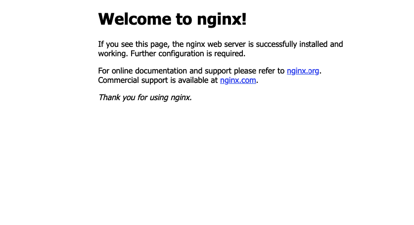

### Clone Recogito Studio (This repository)

The installation of Recogito Studio is contained in this repository. We will now clone the GitHub repository to our instance:

```
git clone --depth 1 https://github.com/recogito/recogito-studio.git
```

Once cloned change to the recogito-studio directory:

```
cd ./recogito-studio
```

### Install dependencies

There are a few additional dependencies we need to have installed in order to install Recogito Studio.

#### Git

Git is the industry standard version control system and the installation process requires that it be installed.

Git is often already installed on many Cloud OS instances, which is true for Digital Oceans Ubuntu droplets. Make sure git is installed:

```
git --version
```

Output:

```
git version 2.43.0
```

#### Docker

Docker is a container generation and management system. We will install it using the [SNAP](https://snapcraft.io/) packager that is standard on Digital Ocean Linux images.

Install Docker:

```
sudo snap install docker
```

#### NPM

NPM (Node Package Manager) is a package manager and management tool for [node js](https://nodejs.org/en) which is a Javascript runtime environment. There are a number of tools and applications in the Recogito Studio platform that require NPM and node js.

Installing NPM will also install node js.

```
sudo apt install npm
```

### Update the environment variables

The recogito-studio repository contains the necessary environment variables to secure and run the Recogito instance. It is important to secure this setup by changing the example .env file to the correct values.

First copy the environment variable example file.

```
cp ./docker/.env.example ./docker/.env
```

Now use a text editor to change the following values in your .env files. We will be using the nano editor here which is included in the Digital Ocean Ubuntu image.

```
nano ./docker/.env
```

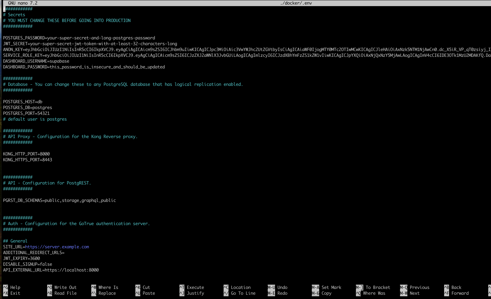

Many of the environment variables should be left as is, but the following need to be updated to ensure proper operation of the installation and to secure it from external modification.

#### POSTGRES_PASSWORD

Set POSTGRES_PASSWORD to an appropriately secure password. We recommend one at least 12 characters long, with uppercase, lowercase, and numeric characters. We do not recommend using special characters as the password is often used in URLs and some special characters are not easily translated to URLs.

#### JWT_SECRET

Set the JWT_SECRET to an appropriately formatted string. The most straightforward way to do this is with openssl which is already installed with Digital Ocean Ubuntu images:

```
openssl rand -base64 36
```

Sample output:

```
MpfZck0AivhcZhKuzPN3Iofm+D0yumW5g5DTD7EgY2x8SvJR
```

#### ANON_KEY

The Recogito Studio server is based on the [Supabase](https://supabase.com/) platform. They have tools that can generate appropriate and random keys for use with Supabase.

Go to the [Securing your services sections here](https://supabase.com/docs/guides/self-hosting/docker#securing-your-services).

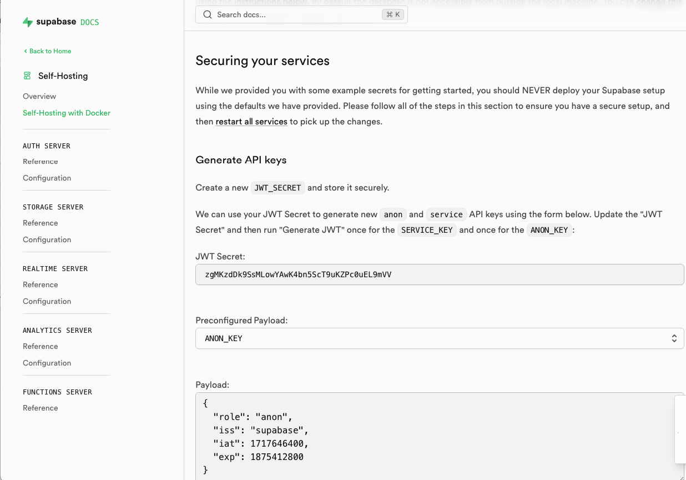

Enter your JWT_SECRET secret you generated above and choose ANON_KEY as the Preconfigured Payload and press the Generate JWT button. Copy the value and replace it in your .env file.

#### SERVICE\_ROLE_KEY

On the same page as above, choose SERVICE_KEY as the Preconfigured Payload (with the same JWT Secret) and press the Generate JWT button. Copy the value and replace it in your .env file.

#### DASHBOARD_PASSWORD

Supabase has a client application that allows management of the Supabase platform. Generate an appropriate and secure password to secure access. Again we recommend one at least 12 characters long. It can contain special characters.

#### SITE_URL

Change this to the domain you have configured for the server URL. Here we will be using https://server.example.com

#### ORG\_ADMIN_PW

An Org admin is a Recogito Studio Superuser. An initial Org Admin is created for your installation with an email address of admin@example.com. Create an appropriate and secure password for this account. Again we recommend one at least 12 characters long. It can contain special characters.

#### ROOM_SECRET

The room secret is to secure the realtime communications channel. Again we will use openssl:

```
openssl rand -base64 24
```

Sample output:

```
MEqms2zIVGarS6bSql6gm64CECWw0ziz
```

#### MINIO\_ROOT_USER

This would be the login username for the Min.io dashboard.

#### MINIO\_ROOT_PASSWORD

This would be the password for the `MINIO_ROOT_USER`  above.

#### PGADMIN\_ADMIN_EMAIL

Username for logging into pgAdmin web app.

#### PGADMIN\_ADMIN_PASSWORD

Password for the above `PGADMIN_ADMIN_EMAIL`.

#### Save your .env file

In the case of nano this is done with a `<ctrl>o` and then hitting return. `<ctrl>x` will exit nano.

### Run the installation script

We are now ready to install and bring up the docker containers which comprise the Recogito Studio platform. We have provided an install script which retrieves and installs supabase, the Recogito server rules and logic, and builds and installs the Recogito client.

From the recogito-studio directory run the install script

```
sudo bash ./install-self-hosted-docker.sh
```

You may need to respond Yes (Y) to the db push.

### Complete Nginx Setup

As stated previously, there are five URLs served from the instance: the client and server URLs, as well as the . To complete the Nginx setup you need to at least activate the client and server routes.

There are five template configuration files included in the root of the recogito-studio repository.

`nginx.client.example.com`

`nginx.server.example.com`

`nginx.minio.example.com`

`nginx.pgadmin.example.com`

`nginx.portainer.example.com`

The following assumes you are still in the recogito-studio directory and have setup your urls on your DNS server.

#### Copy the client configuration and update

First you need to copy the Nginx configuration for the client routes to the Nginx sites-available directory.

Replace client.example.com with your client url.

```
sudo cp ./nginx.client.example.com /etc/nginx/sites-available/client.example.com
```

Now we customize this configuration to your setup. Again using the nano text editor:

```
sudo nano /etc/nginx/sites-available/client.example.com
```

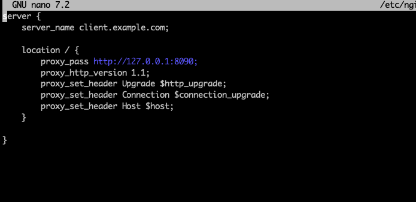

Here simply replace client.example.com with your client url. Save and exit nano.

#### Copy the server configuration and update

Again copy the template, replacing server.example.com with your server URL.

```
sudo cp ./nginx.server.example.com /etc/nginx/sites-available/server.example.com
```

And edit, replacing with the name created above:

```
sudo nano /etc/nginx/sites-available/server.example.com
```

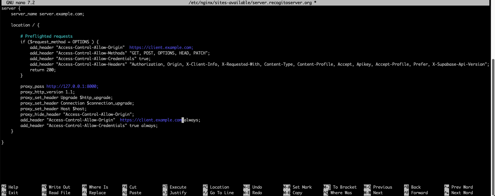

Here we replace server.example.com for the `server_name` attribute with your correct server URL.

In the Preflighted Requests section, on the line `add_header "Access-Control-Allow-Origin"  https://client.example.com;` replace client.example.com with your correct value for your client URL.

Finally near the bottom replace the url in `add_header "Access-Control-Allow-Origin"  https://client.example.com always;` with your client URL.

#### Copy the support configurations and update

The process for `nginx.minio.example.com`, `nginx.pgadmin.example.com`, `nginx.portainer.example.com` are all the same. Copy the template to `/etc/nginx/sites-available` directory, replacing `example.com` with your domain. 

For example, with pgAdmin:

~~~
sudo cp ./nginx.pgadmin.example.com /etc/nginx/sites-available/pgadmin.[your domain].com
~~~

And edit

```
sudo nano /etc/nginx/sites-available/pgadmin.[your domain].com
```

For all three files replace `server_name` and the url in `add_header "Access-Control-Allow-Origin"` with your domain name:

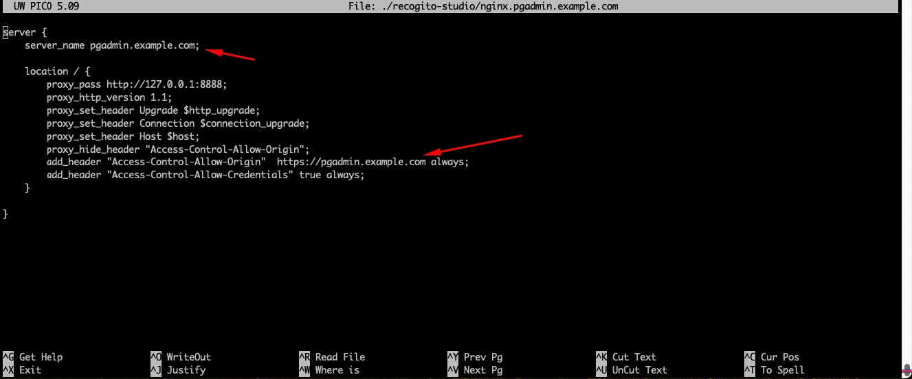

#### Update nginx.conf

We need to make a small modification to the default Nginx configuration.

```
sudo nano /etc/nginx/nginx.conf
```

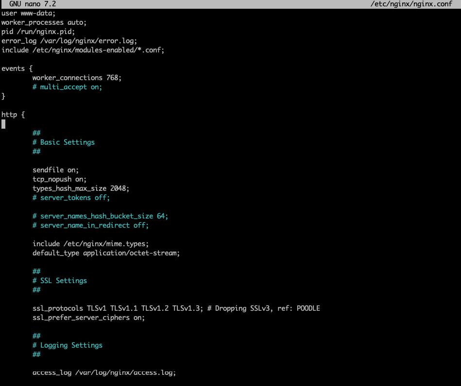

In the http block at top paste this value:

```
    map $http_upgrade $connection_upgrade {
        default upgrade;
        '' close;
    }
```

#### Link the configuration

Nginx has two directories, sites-available and sites-enabled. You enable a site by creating a symbolic link. Be sure to replace the example.com URLs with your site's values:

```
sudo ln -s /etc/nginx/sites-available/server.example.com /etc/nginx/sites-enabled/

sudo ln -s /etc/nginx/sites-available/client.example.com /etc/nginx/sites-enabled/

sudo ln -s /etc/nginx/sites-available/pgadmin.example.com /etc/nginx/sites-enabled/

sudo ln -s /etc/nginx/sites-available/minio.example.com /etc/nginx/sites-enabled/

sudo ln -s /etc/nginx/sites-available/portainer.example.com /etc/nginx/sites-enabled/
```

#### Restart Nginx with the new configurations

First let's verify the configurations.

```
sudo nginx -t
```

Sample output:

```
nginx: the configuration file /etc/nginx/nginx.conf syntax is ok
nginx: configuration file /etc/nginx/nginx.conf test is successful
```

And now restart Nginx to make the configuration active:

```
sudo systemctl restart nginx
```

### Add Let's Encrypt certificates

In order for our HTTPS routes to be valid, we need domain certificates. The is easily done with [Let's Encrypt](https://letsencrypt.org/) free certificates. We will use the procedure outlined [here](https://www.digitalocean.com/community/tutorials/how-to-secure-nginx-with-let-s-encrypt-on-ubuntu-22-04).

#### Install Let's Encrypt

The Let's Encrypt package is available via snap. First we will make sure snap is up to date:

```
sudo snap install core; sudo snap refresh core
```

Install certbot. This is an automatically renewing certificate service.

```
sudo snap install --classic certbot
```

And link it to `/usr/bin`:

```
sudo ln -s /snap/bin/certbot /usr/bin/certbot
```

Generate and install a certificate for the client routes. As always, change client.example.com to your client URL:

```
sudo certbot --nginx -d client.example.com
```

You will need to provide a email for urgent notices and answer `Yes` to the terms of service. You can answer how you like about sharing your email with [EFF](https://www.eff.org/).

Do the same for the other routes.

```
sudo certbot --nginx -d server.example.com

sudo certbot --nginx -d pgadmin.example.com

sudo certbot --nginx -d minio.example.com

sudo certbot --nginx -d portainer.example.com
```

#### Confirm auto-renewal

Certbot will automatically renew your certificate before its expiration. It is a good idea to verify this will work:

```
sudo systemctl status snap.certbot.renew.service
```

Sample output:

```
○ snap.certbot.renew.service - Service for snap application certbot.renew
     Loaded: loaded (/etc/systemd/system/snap.certbot.renew.service; static)
     Active: inactive (dead)
TriggeredBy: ● snap.certbot.renew.timer
```

And do a dry run of the renewal process:

```
sudo certbot renew --dry-run
```

Sample Output:

```
Saving debug log to /var/log/letsencrypt/letsencrypt.log

- - - - - - - - - - - - - - - - - - - - - - - - - - - - - - - - - - - - - - - -
Processing /etc/letsencrypt/renewal/client.example.com.conf
- - - - - - - - - - - - - - - - - - - - - - - - - - - - - - - - - - - - - - - -
Account registered.
Simulating renewal of an existing certificate for client.example.com

- - - - - - - - - - - - - - - - - - - - - - - - - - - - - - - - - - - - - - - -
Processing /etc/letsencrypt/renewal/server.exmaple.com.conf
- - - - - - - - - - - - - - - - - - - - - - - - - - - - - - - - - - - - - - - -
Simulating renewal of an existing certificate for server.example.com

- - - - - - - - - - - - - - - - - - - - - - - - - - - - - - - - - - - - - - - -
Congratulations, all simulated renewals succeeded:
  /etc/letsencrypt/live/client.example.com/fullchain.pem (success)
  /etc/letsencrypt/live/server.example.com/fullchain.pem (success)
- - - - - - - - - - - - - - - - - - - - - - - - - - - - - - - - - - - - - - - -
```

### Test the client

The site should now be up and running, secured by https, and ready for use.

Using your browser navigate to your client URL. You should see:


Go ahead and sign in with the initial Org Admin which has a username of `admin@example.com` and the password you set in the .env file for `ORG_ADMIN_PW`.

### Test access to studio

Using your browser navigate to your server URL. The username will be `supabase` and the password you set in the .env file for `DASHBOARD_PASSWORD`.

The Supabase studio client gives you access to the DB and allows for User creation. Detailed usage can be seen [here](https://supabase.com/docs).

### Other resources

If you are interested in adding plugins, check out the [Recogito Studio SDK](https://github.com/recogito/recogito-studio-sdk). [This section](https://github.com/recogito/recogito-studio-sdk) details adding plugins to your installation.

As stated before, use of the `plugin-ner` plugin requires additional resources. Check out [the repository](https://github.com/recogito/plugin-ner) for more information.

## What's next, what's missing?

There are a few more advanced topics not discussed here that will be detailed in future releases.

- Configuration and Customization

  Many aspects of the UI and policy model can be customized to your needs.

- SMTP Setup

  SMTP integration for things like password resets, invitations, etc.

- Logging

  Supabase can be configured to connect and send data to [Logflare](https://logflare.app/).

- Using External Postgres Databases

  The self-hosted deployment could be customized to connect to a remote Postgres DB cluster.

- Install Script Hardening

  Currently the install script has not been hardened for error handling nor polished for output formatting.
